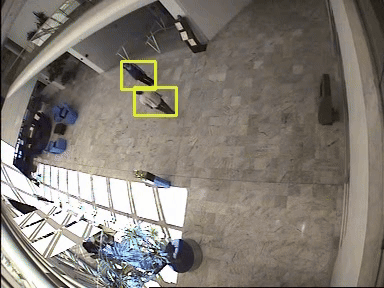

# Description

DeepFA is a small libary to integate symbolic finite automata with 
knowledge compilation techniques to allow for a clean integration 
between symbolic automata and neural networks

# Installation

With poetry:
```poetry add git+ssh://git@github.com:nmanginas/deepfa.git```

You will also need the [dsharp](https://github.com/QuMuLab/dsharp) system. 
You need to make it and preferably put it on your path altough there 
are options to pass the real path of dsharp in which case you will not 
need to add it to your path.

# Usage

The package defines an easy to use low level API for performing operations
on DeepFA

```python
import nnf
import torch
from deepfa.automaton import DeepFA

a, b = nnf.Var("a"), nnf.Var("b")

transitions = {0: {0: a, 1: ~a}, 1: {1: a & b, 0: (a & b).negate()}}
fa = DeepFA(transitions, 0, {1})
fa.dot().view()

weights = {"a": torch.Tensor([0.3, 0.6]), "b": torch.Tensor([0.8, 0.9])}

def labelling_function(var: nnf.Var) -> torch.Tensor:
    return weights[str(var.name)] if var.true else 1 - weights[str(var.name)]

# The probability of accepting a sequence where a is true in timestep 1 with
# probability 0.3 and with probability 0.6 in timestep 2. For b the probs are
# 0.8 and 0.9 respectivelly.
acceptance_prob = fa.forward(labelling_function)

# The weight of the most probable path that leads to an accepting state
# with the same probs as above. This is the path q1 -> q2 -> q2. So
# transition ~a is True in the first timestep and transition a & b is true
# in the second timestep.
mpe = fa.forward(labelling_function, max_propagation=True)

# Compute the posterior of symbols given that the sequence is accepted. This
# is easily done via gradients.

weights = {"a": torch.Tensor([0.3, 0.6]), "b": torch.Tensor([0.8, 0.9])}
for value in weights.values():
    value.requires_grad_()

def labelling_function_(var: nnf.Var) -> torch.Tensor:
    # We have to detach the gradient of the negated literals.
    return (
        weights[str(var.name)] if var.true else 1 - weights[str(var.name)].detach()
    )

acceptance_prob = fa.forward(labelling_function_)
posterior_marginals = {}
for symbol, weight in weights.items():
    posterior_marginals[symbol] = (
        torch.autograd.grad(acceptance_prob, weight, retain_graph=True)[0]
        * weight
        / acceptance_prob
    )

# Computing the most probable assignment given that the sequence
# is accepted is also trivial via derivatives. The task is to uncover
# the path that leads to the MPE. Usually this is done via backtracking
# but gradient work just as well and are much simpler since the derivative
# of max is essentially 1 for the element which would be chosen in backtracking
# and is zero otherwise.

mpe = fa.forward(labelling_function_, max_propagation=True)

most_probable_assignment = {}
for symbol, weight in weights.items():
    most_probable_assignment[symbol] = (
        torch.autograd.grad(mpe, weight, retain_graph=True)[0] * weight / mpe
    )
```

Here is an example for categorical variables which require a bit of 
special handling.

```python
import nnf
import torch
from deepfa.automaton import DeepFA

# Define 4 symbols the first 3 of which are categorical.
# This means exactly one of them will be true in each timestep
a, b, c, d = map(nnf.Var, ("a", "b", "c", "d"))

# We must define a constraint that tells the compiled circuits
# thate a, b and c are indeed a categorical group.
categorical_constraint = (a | b | c) & (~a | ~b) & (~a | ~c) & (~b | ~c)


transitions = {
    0: {
        0: (a | b) & d & categorical_constraint,
        1: ((a | b) & d).negate() & categorical_constraint,
    },
    1: {0: ~c & categorical_constraint, 1: c & categorical_constraint},
}

deepfa = DeepFA(transitions, 0, {1})

# Observe that for each timestep the sum of the probabilities of
# a, b and c must be 1 since the define a categorical distribution.
weights = {
    "a": torch.Tensor([0.2, 0.2]),
    "b": torch.Tensor([0.7, 0.5]),
    "c": torch.Tensor([0.1, 0.3]),
    "d": torch.Tensor([0.4, 0.7]),
}


def labelling_function(var: nnf.Var) -> torch.Tensor:
    # This is very much like the standard labelling function
    # introduced above but we always give the value 1 for
    # negative literals. It's just the way it is.
    if str(var.name) in ("a", "b", "c"):
        return (
            weights[str(var.name)]
            if var.true
            else torch.ones_like(weights[str(var.name)])
        )

    return weights[str(var.name)] if var.true else 1 - weights[str(var.name)]


# Compute the actual probability
acceptance_prob = deepfa.forward(labelling_function)
```

Specifying an automaton via (P)LTLf. This is just for 
convenience. The integration is done with LTLf2DFA which 
is perhaps the least scalable (P)LTLf compiler. It is based
on MONA so you will need to install it with 
```apt install mona``` on Debian based systems.

```python
from deepfa.utils import parse_sapienza_to_fa

fa = parse_sapienza_to_fa("G((tired | blocked) -> WX(!fast))")
fa.dot().view()
```

# Neuro-symbolic interface

This package also allows for easy integration of symbolic automata
and neural networks. We showcase this on a simple example.

  

This sequence of three images needs to be classified with a symbolic 
automaton. For each image three symbols must be extracted. From top to 
bottom, these are; whether the road is blocked, whether the car is going fast 
and whether the driver is tired. Each is depicted by an emoji. 
For the middle image the correct labeling is {blocked: 1, fast: 0, tired: 0} (again
read from top to bottom)

A neural network is used to bridge between the complex image
representation and the symbolic input expected by the DFA. To follow 
this example you should install ```torchvision``` which is not in 
the dependencies of the ```deepfa``` package.

```python
import torch
import torchvision

images = torch.stack(
    [
        torchvision.io.decode_image("assets/image_{}.png".format(i)).float()
        / 255
        for i in range(1, 4)
    ]
)

symbol_grounder = torch.nn.Sequential(
    torch.nn.Conv2d(3, 16, 3),
    torch.nn.ReLU(),
    torch.nn.MaxPool2d(2),
    torch.nn.Conv2d(16, 32, 3),
    torch.nn.ReLU(),
    torch.nn.MaxPool2d(2),
    torch.nn.Conv2d(32, 16, 3),
    torch.nn.ReLU(),
    torch.nn.MaxPool2d(2),
    torch.nn.Flatten(),
    torch.nn.Linear(144 + (240 * 2), 128),
    torch.nn.ReLU(),
    torch.nn.Linear(128, 3),
    torch.nn.Sigmoid(),
)

symbol_grounder.load_state_dict(torch.load("assets/symbol_grounder_weights.pt"))

image_predictions = symbol_grounder(images)

print(image_predictions)
```

For the second image the predicted probabilities are: 
{blocked: 0.93, fast: 0, tired: 0.57}. We can now use 
these neural network predictions to compute the probability 
that our symbolic pattern is satisfied by the image sequence. 

```python
from deepfa.utils import parse_sapienza_to_fa
fa = parse_sapienza_to_fa("G((tired | blocked) -> WX(!fast))")
```

This will convert the temporal logic formula to the automaton:


```python
weights = {
    symbol: symbol_probs
    for symbol, symbol_probs in zip(("blocked", "fast", "tired"), image_predictions.T)
}


def labelling_function(var: nnf.Var) -> torch.Tensor:
    return weights[str(var.name)] if var.true else 1 - weights[str(var.name)]


state_probabilities = fa.forward(
    labelling_function, accumulate=True, accumulate_collapse_accepting=False
)

print(state_probabilities)
```

This will show the probability of being in each of the automaton states for the three
timesteps in the sequence. Dropping ```accumulate``` arguments which keep the value
of probabilities for all timesteps would result in the probability of accepting the
sequence which is this case is: ```tensor([0.9848], grad_fn=<SumBackward1>)```. 
Importantly this carries a gradient which can be used to train the system in end to end fashion. 

# Explanation generation.

Let's consider however what is the most possible world in which the sequence is
accepted:

```python
mpe = fa.forward(labelling_function, max_propagation=True)

most_probable_assignment = {}
for symbol, weight in weights.items():
    most_probable_assignment[symbol] = (
        torch.autograd.grad(mpe, weight, retain_graph=True)[0] * weight / mpe
    )

print(mpe)
print(most_probable_assignment)
```

The system finds the most probable explanation for accepting the sequence to be:

| timestep | blocked | fast | tired |
| -------- | ------- | ---- | ----- |
| 1        | 1       | 1    | 1     |
| 2        | 1       | 0    | 1     |
| 3        | 0       | 0    | 0     |

with a probability of 0.16. Interestingly this is also the correct labelling for the image sequence.


# Caviar Event Recognition

We now show another NeSy application in the caviar dataset. Consider the video:



It shows a pair of people performing certain activities. Each person is performing a high-level
activity and the pair is performing a high level event. For each frame in this example the following
information is true:

| Distance | Simple Event P1 | Simple Event P2 | Complex Event  |
|----------|----------------|----------------|---------------|
| 31.06    | inactive       | walking        | no_event     |
| 24.19    | inactive       | walking        | no_event     |
| 15.23    | inactive       | active         | interacting  |
| 12.65    | inactive       | active         | interacting  |
| 12.08    | active         | active         | interacting  |
| 12.04    | active         | active         | interacting  |
| 12.04    | active         | active         | interacting  |
| 17.2     | walking        | walking        | interacting  |
| 13.6     | walking        | walking        | interacting  |
| 17.03    | walking        | walking        | interacting  |
| 24.02    | walking        | walking        | interacting  |
| 24.02    | walking        | walking        | interacting  |
| 29.15    | walking        | walking        | no_event     |
| 33.38    | walking        | walking        | no_event     |
| 31.14    | walking        | walking        | no_event     |
| 26.08    | walking        | walking        | no_event     |
| 19.42    | walking        | walking        | moving       |
| 16.12    | walking        | walking        | moving       |


where distance denotes the distance between the two people, the two simple event columns the low-level
activities each is performing and the complex event column the high-level event the pair is performing. First we load a network from 
a checkpoint.

```python
import torch

class CNN(torch.nn.Module):
    def __init__(self):
        super().__init__()
        self.encoder = torch.nn.Sequential(
            torch.nn.Conv2d(3, 32, 5, 1),
            torch.nn.ReLU(),
            torch.nn.MaxPool2d(2),
            torch.nn.Conv2d(32, 64, 5, 1),
            torch.nn.ReLU(),
            torch.nn.MaxPool2d(2),
            torch.nn.Conv2d(64, 64, 5, 1),
            torch.nn.ReLU(),
            torch.nn.MaxPool2d(2),
            torch.nn.Conv2d(64, 64, 5, 1),
            torch.nn.ReLU(),
            torch.nn.MaxPool2d(2),
        )

    def forward(self, images: torch.Tensor):
        return self.encoder(images).reshape(images.shape[0], -1)


class CaviarNet(torch.nn.Module):
    def __init__(self):
        super().__init__()
        self.cnn_backbone = CNN()
        self.projection = torch.nn.Linear(64, 4)

    def forward(
        self, p1_bbs: torch.Tensor, p2_bbs: torch.Tensor, distances: torch.Tensor
    ) -> dict[str, torch.Tensor]:
        p1_predictions, p2_predictions = self.projection(
            self.cnn_backbone(p1_bbs)
        ).softmax(-1), self.projection(self.cnn_backbone(p2_bbs)).softmax(-1)

        return {
            "p1": p1_predictions,
            "p2": p2_predictions,
            "close(p1, p2)": (distances < 25).float().unsqueeze(-1),
        }


caviar_net = CaviarNet()
caviar_net.load_state_dict(torch.load("assets/caviar_checkpoint.pt"))
```

We then load the frame information which includes the distance and
the bounding boxes for each person from which the neural network
should predict the low-level activities (simple events) they are 
performing. Next we define an automaton which can compute the 
high-level (complex) events given the low-level activities.

```python
import nnf
import itertools
from deepfa.automaton import DeepFA

def generate_constraint(constrained_vars: list[nnf.Var]):
    return nnf.And(
        [
            nnf.And(
                [
                    (~v1 | ~v2)
                    for v1, v2 in itertools.combinations(constrained_vars, r=2)
                ]
            ),
            nnf.Or(constrained_vars),
        ],
    )


(
    p1_walking,
    p1_running,
    p1_active,
    p1_inactive,
    p2_walking,
    p2_running,
    p2_active,
    p2_inactive,
    close_p1_p2,
) = (
    nnf.Var(var_name)
    for var_name in [
        "p1_walking",
        "p1_running",
        "p1_active",
        "p1_inactive",
        "p2_walking",
        "p2_running",
        "p2_active",
        "p2_inactive",
        "close_p1_p2",
    ]
)

constraint_1, constraint_2 = generate_constraint(
    [p1_walking, p1_running, p1_active, p1_inactive]
), generate_constraint([p2_walking, p2_running, p2_active, p2_inactive])

t12 = p1_walking & p2_walking & close_p1_p2
t13 = close_p1_p2 & (p1_active | p1_inactive) & (p2_active | p2_inactive)

t21 = (
    (~close_p1_p2 & (p1_walking | p2_walking))
    | (p1_active & (p2_active | p2_inactive))
    | (p1_inactive & p2_active)
    | p1_running
    | p2_running
)

t31 = ~close_p1_p2 & (p1_walking | p2_walking) | p1_running | p2_running

t11 = t12.negate() & t13.negate() & constraint_1 & constraint_2
t22 = t21.negate() & constraint_1 & constraint_2
t33 = t31.negate() & constraint_1 & constraint_2

t12 &= constraint_1 & constraint_2
t13 &= constraint_1 & constraint_2
t21 &= constraint_1 & constraint_2
t31 &= constraint_1 & constraint_2

transitions = {
    0: {
        0: t11,
        1: t12,
        2: t13,
    },
    1: {0: t21, 1: t22},
    2: {0: t31, 2: t33},
}

deepfa = DeepFA(transitions, 0, {1})
```

The automaton has three states with state 0 representing no_event, 
state 1 meeting and state 2 interacting. We can then make
predictions about the probability of the complex event at each 
timestep, i.e. the probability of being in each state given the 
predictions of the neural network.

```python
with open("assets/caviar_data.pkl", "rb") as input_file:
    caviar_data = pickle.load(input_file)

# Load the bounding boxes which we have already extracted
# from the raw video frames, and along with the distance
# in each frame pass them to the neural network.
bb1, bb2 = (
    torch.stack(
        [torch.tensor(frame["objects"][0]["bounding_box"]) for frame in caviar_data]
    ).permute(0, 3, 1, 2)
    / 255,
    torch.stack(
        [torch.tensor(frame["objects"][1]["bounding_box"]) for frame in caviar_data]
    ).permute(0, 3, 1, 2)
    / 255,
)

simple_event_predictions = caviar_net(
    bb1, bb2, torch.tensor([frame["distance"] for frame in caviar_data])
)

weights = (
    {
        var: value
        for var, value in zip(
            ["p1_walking", "p1_running", "p1_active", "p1_inactive"],
            simple_event_predictions["p1"].T,
        )
    }
    | {
        var: value
        for var, value in zip(
            ["p2_walking", "p2_running", "p2_active", "p2_inactive"],
            simple_event_predictions["p2"].T,
        )
    }
    | {"close_p1_p2": simple_event_predictions["close(p1, p2)"]}
)


def labelling_function(var: nnf.Var) -> torch.Tensor:
    if str(var.name).startswith("p"):
        return (
            weights[str(var.name)]
            if var.true
            else torch.ones_like(weights[str(var.name)])
        )

    return (weights[str(var.name)] if var.true else 1 - weights[str(var.name)]).squeeze(
        -1
    )


state_probs = deepfa.forward(
    labelling_function, accumulate=True, accumulate_collapse_accepting=False
).squeeze(1)

label2int = {"no_event": 0, "moving": 1, "interacting": 2}

prediction_and_true_class_data = [
    (
        dict(zip(label2int.keys(), timestep_preds.tolist())),
        caviar_data[i]["silver_event"],
    )
    for i, timestep_preds in enumerate(state_probs)
]
```

At this point we have data that looks like the following:

| P_No_Event | P_Moving  | P_Interacting | True_Class   |
|------------|----------|---------------|-------------|
| 1.0000     | 0.0000   | 0.0000        | no_event   |
| 0.5078     | 0.2687   | 0.2235        | no_event   |
| 0.3911     | 0.1940   | 0.4150        | interacting |
| 0.3102     | 0.1390   | 0.5508        | interacting |
| 0.2399     | 0.0979   | 0.6622        | interacting |
| 0.1530     | 0.0504   | 0.7966        | interacting |
| 0.1098     | 0.0707   | 0.8195        | interacting |
| 0.0372     | 0.1419   | 0.8209        | interacting |
| 0.0263     | 0.1500   | 0.8238        | interacting |
| 0.0016     | 0.1746   | 0.8238        | interacting |
| 0.0011     | 0.1751   | 0.8238        | interacting |
| 0.0013     | 0.1749   | 0.8238        | interacting |
| 0.9610     | 0.0003   | 0.0387        | no_event   |
| 1.0000     | 0.0000   | 0.0000        | no_event   |
| 1.0000     | 0.0000   | 0.0000        | no_event   |
| 1.0000     | 0.0000   | 0.0000        | no_event   |
| 0.1049     | 0.8924   | 0.0027        | moving     |
| 0.0139     | 0.9831   | 0.0030        | moving     |

which one can see is quite accurate in predicting complex 
events based on raw images using both a neural network 
for extracting simple events from the raw video stream and 
an automaton to perform reasoning about the event dynamics 
on top of the neural predictions.

#### Explanation generation

We will now investigate the most probable sequence of 
simple events that occured such that moving is true
in the penultimate timestep of the trace

```python
weights["close_p1_p2"].requires_grad_()


def labelling_function_mpe(var: nnf.Var) -> torch.Tensor:
    if str(var.name).startswith("p"):
        return (
            weights[str(var.name)]
            if var.true
            else torch.ones_like(weights[str(var.name)])
        )[:16]

    return (weights[str(var.name)] if var.true else 1 - weights[str(var.name)]).squeeze(
        -1
    )[:16]


mpe = deepfa.forward(labelling_function_mpe, max_propagation=True)
most_probable_assignment = {}
for symbol, weight in weights.items():
    most_probable_assignment[symbol] = (
        torch.autograd.grad(mpe, weight, retain_graph=True)[0] * weight / mpe
    )[:16]
```

We drop the final two timesteps from the predictions and try to find the 
most probable sequence that led to ```moving``` being true. The
abduced trace is as follows:

| p1_simple_event | p2_simple_event | close_p1_p2 |
|----------------|----------------|-------------|
| walking       | walking         | 0           |
| walking       | walking         | 1           |
| walking       | active          | 1           |
| walking       | active          | 1           |
| walking       | active          | 1           |
| active        | active          | 1           |
| walking       | active          | 1           |
| walking       | walking         | 1           |
| walking       | walking         | 1           |
| walking       | walking         | 1           |
| walking       | walking         | 1           |
| walking       | walking         | 1           |
| inactive      | inactive        | 0           |
| inactive      | inactive        | 0           |
| inactive      | inactive        | 0           |
| inactive      | inactive        | 0           |

